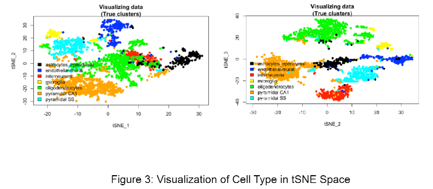

# Statistical Genomics and High Dimensional Inference

High dimensional inference is a technique commonly used for studying biological data such as genomics due to the large number of features generated during research. These techniques help to extract information from the data by focusing on the features or combination of features that explain the most variance in the data, such as PCA or t-SNE.

## Course Project

- Authors: Anirban Chowdhury, Daniel Nason

Links:
- [Code](./final_project/36-669_final_project.Rmd)
- [Report](./final_project/36-669_final_project.pdf)

This project evaluates the use of various statistical learning techniques on the Zeisel mice dataset. The goal is to better understand the performance of various algorithms on this data, both for comparing clusters generated from unsupervised learning models as well as multi-class classification on the categories found by the researchers in the Zeisel dataset.

### Data

The raw data on the Zeisel mice can be found [here](https://github.com/xuranw/469_public/blob/main/project/Zeisel.csv?raw=true).

### Unsupervised Learning

#### PCA

#### t-SNE

#### Misclustering rate

Misclustering rates by method and dimension reduction technique:

### Supervised Learning

Misclassification rates by method and dimension reduction technique:

## Findings

Due to the high dimensionality of the data, we employ multiple dimension reduction techniques before fitting our models to improve performance. We see that for the unsupervised learning models, hierarchical clustering using the t-SNE dimension reduction technique has the least disagreement of clusters compared to the clusters generated by the researchers. Additionally, for the supervised learning models, the logistic regression model built on data transformed using PCA minimizes classification error. 